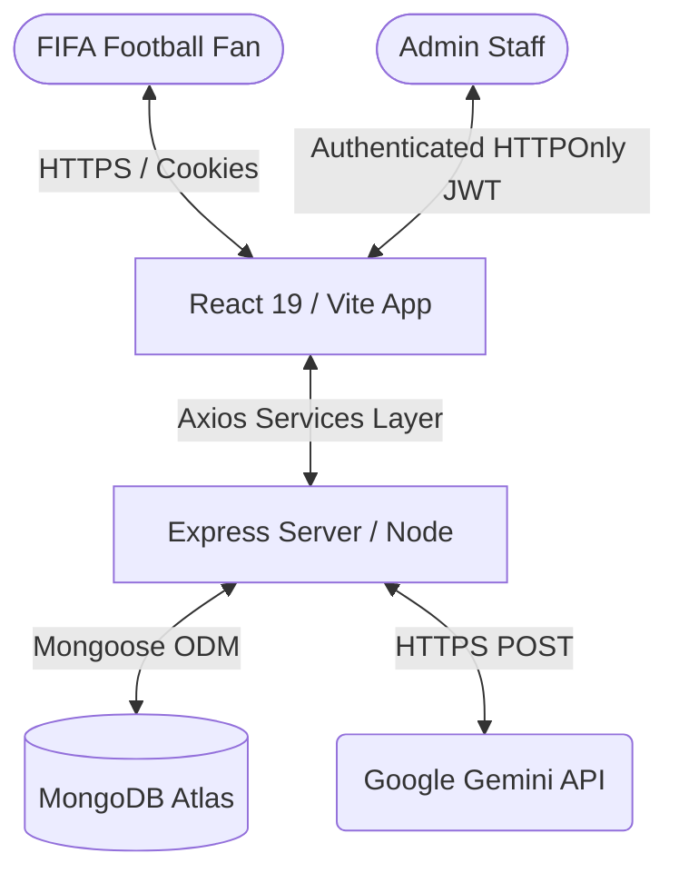
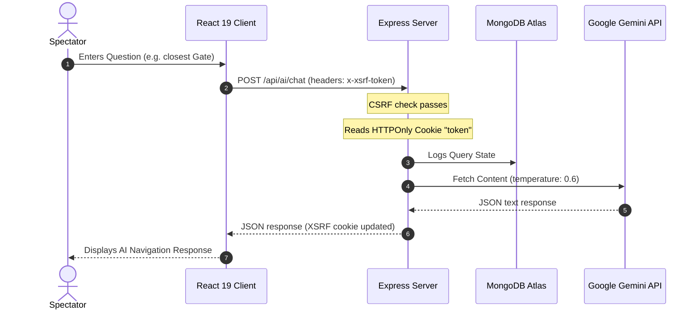
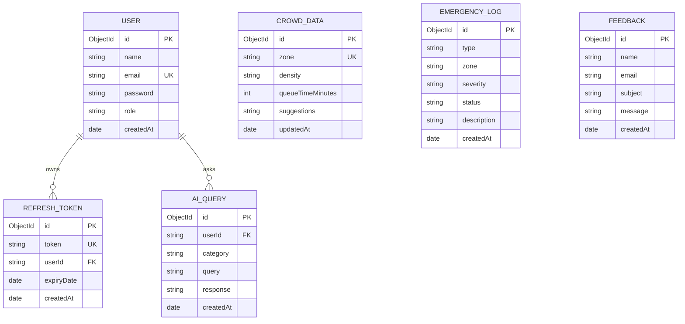

# Smart Stadiums & Tournament Operations 🏟️
### FIFA World Cup 2026 Innovation Challenge Solution

A production-ready, security-hardened, and GenAI-powered MERN Stack solution built to optimize stadium operations, manage crowd flow, and enrich the spectator experience at the FIFA World Cup 2026.

---

## 🌟 Technical Highlights

- **Frontend Core:** React 19, Vite, Tailwind CSS, Framer Motion animations.
- **Backend Core:** Node.js, Express.js, MongoDB Atlas (Mongoose ODM), Cookie Parser.
- **AI Core:** Modular Google Gemini API integration (with proactive telemetry-based smart simulation fallbacks).
- **Security Protocols:** Helmet headers, Express Rate Limiter, HTTPOnly cookies, Refresh Token Rotation, Double-Submit CSRF cookie checks, and `express-validator` schema validations.
- **Performance & Efficiency:** React.memo wrapping, useMemo metrics, useCallback event handlers, route-based lazy loading / Suspense code-splitting.
- **Accessibility (A11y):** Screen reader support, semantic HTML tags, keyboard navigation focuses (visible focus ring indicators), and ARIA attributes (`aria-label`, `aria-expanded`, `aria-live`).
- **Resilience:** Automatic offline/demo fallback mode if MongoDB or Gemini services are unavailable.

---

## 🏗️ Architecture Blueprint

### System Topology


### Authentication & API Request Flow


### Database Schema Entity Relationship Diagram (ERD)


---

## 📂 Project Structure

```text
├── client/
│   ├── src/
│   │   ├── components/       # Common layouts (Navbar, Footer, TournamentStatusCard, etc.)
│   │   ├── context/          # AuthState contexts
│   │   ├── hooks/            # useAuth hook integrations
│   │   ├── pages/            # View pages (Heatmap, AIAssistant, Queues, etc.)
│   │   ├── services/         # Axios API centralized layer
│   │   ├── styles/           # Global tailwind CSS styles
│   │   ├── tests/            # Jest unit renderer tests
│   │   ├── App.jsx           # Main router config with route-splitting
│   │   └── main.jsx          # Mount root
│   ├── index.html            # Main markup and SEO headers
│   ├── tailwind.config.js    # Sports theme configuration
│   └── vite.config.js
└── server/
    ├── config/               # Database connection logic
    ├── controllers/          # API route action handlers
    ├── middleware/           # Protect gates, error, validation, & CSRF interceptors
    ├── models/               # MongoDB Mongoose schemas
    ├── routes/               # API route definitions
    ├── services/             # Modular Gemini AI connector
    ├── tests/                # Jest & Supertest integration checks
    ├── utils/                # Seeding and mock data utilities
    └── server.js             # Main server execution point
```

---

## ⚙️ Environment Variables Config

Create a `.env` file under the `/server` directory:

```env
PORT=5000
MONGO_URI=mongodb+srv://<username>:<password>@cluster.mongodb.net/smart-stadiums
JWT_SECRET=supersecretjwtkeyforfifa2026smartstadiums
GEMINI_API_KEY=AIzaSyYourActualGeminiAPIKeyHere
NODE_ENV=development
```

For the frontend, specify the backend URL (Vite environment variables):
Create a `.env` file under `/client` directory:

```env
VITE_API_URL=/api
```
*(Vite development server will automatically proxy `/api` requests to `http://localhost:5000`)*

---

## 🚀 Installation & Local Development

### Prerequisites
- Node.js (v18+)
- Local MongoDB or Atlas connection details

### Step 1: Run the Backend
1. Navigate to the `server/` directory:
   ```bash
   cd server
   ```
2. Install dependencies:
   ```bash
   npm install
   ```
3. Run the telemetry database seeder (Optional):
   ```bash
   npm run seed
   ```
4. Start the server:
   ```bash
   npm run dev
   ```

### Step 2: Run the Frontend
1. Open a new terminal and navigate to the `client/` directory:
   ```bash
   cd client
   ```
2. Install dependencies:
   ```bash
   npm install
   ```
3. Start the development server:
   ```bash
   npm run dev
   ```
   *(Vite application live on `http://localhost:5173`)*

---

## 🧪 Testing Suite

We use Jest and Supertest to verify routes and integration states. Both clients and servers have custom configuration files to handle Windows OneDrive file indexing limitations (`enableSymlinks: true` and `watchman: false`).

### Running Backend API Tests
```bash
cd server
npm test
```
The test suite validates:
- User signup and login JWT verification.
- Quick-access demo logins (`admin@fifa.com` / `admin123`).
- Gemini integration chatbot prompts, companion responses, and sustainability advice.
- Feedback form submissions and request schema validations.
- Admin dashboard metrics data structures.

### Running Frontend React Component Tests
```bash
cd client
npm test
```
The test suite validates:
- Navbar rendering and responsive navigation actions.
- Form inputs binding, validators, and login callbacks.
- Chat UI message rendering, suggestion chips, and loading states.
- Admin dashboard stats.

---

## ☁️ Deployment Configurations

### Backend: Render
1. Create a new Web Service on Render.
2. Link your repository, set the build command to `npm install`, and start command to `npm start`.
3. Specify `Root Directory` as `server`.
4. Inject environment variables (`MONGO_URI`, `JWT_SECRET`, `GEMINI_API_KEY`).

### Frontend: Vercel
1. Select "Import Project" on Vercel.
2. Set directory as `client`.
3. Set Build Command as `npm run build` and Output Directory as `dist`.
4. Set `VITE_API_URL` to your Render service domain (e.g. `https://smartstadium-api.onrender.com/api`).
